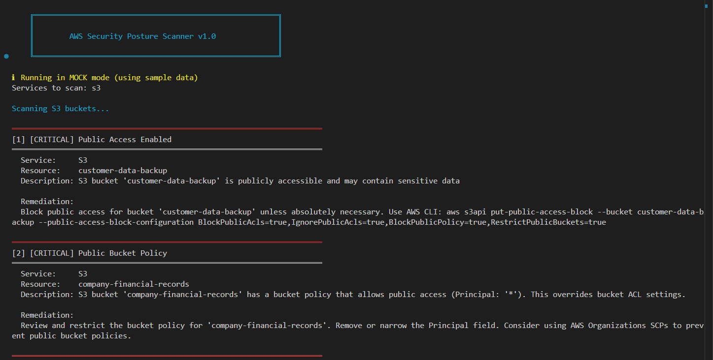

# AWS Security Posture Scanner

A Python-based security scanner that identifies common misconfigurations in AWS environments and provides automated remediation recommendations.

## Project Overview

This tool helps security teams identify and remediate common AWS security misconfigurations including:
- Public S3 buckets with sensitive data exposure
- Overly permissive security groups (0.0.0.0/0 rules)
- IAM users without MFA enabled
- Unencrypted EBS volumes
- Stale/unused IAM access keys

## Features

- **Multi-service scanning**: S3, EC2, IAM, and more
- **Severity-based reporting**: Critical, High, Medium, Low
- **JSON and HTML reports**: Easy integration with CI/CD pipelines
- **Mock mode**: Test the scanner without AWS credentials
- **Auto-remediation scripts**: Generate fixes for common issues

## Requirements

- Python 3.8+
- boto3 (AWS SDK for Python)
- Click (CLI framework)

## Installation

```bash
# Clone the repository
git clone https://github.com/hell-99/aws-security-scanner.git
cd aws-security-scanner

# Install dependencies
pip install -r requirements.txt
```

## Usage

### Mock Mode (No AWS credentials needed)
```bash
python scanner.py --mock
```

### Real AWS Scanning
```bash
# Ensure AWS credentials are configured
python scanner.py --profile default

# Scan specific services
python scanner.py --services s3,ec2,iam

# Generate HTML report
python scanner.py --output html --report-file security-report.html
```

## Sample Output

```
AWS Security Scanner v1.0
========================

[CRITICAL] S3 Bucket 'customer-data-backup' is publicly accessible
[HIGH] Security Group 'sg-12345' allows SSH (port 22) from 0.0.0.0/0
[MEDIUM] IAM user 'john.doe' does not have MFA enabled
[LOW] EBS volume 'vol-98765' is not encrypted

Summary: 4 issues found (1 critical, 1 high, 1 medium, 1 low)
```




## Project Structure

```
aws-security-scanner/
├── scanner.py           # Main CLI entry point
├── scanners/
│   ├── __init__.py
│   ├── s3_scanner.py    # S3 bucket security checks
│   ├── ec2_scanner.py   # EC2 & security group checks
│   └── iam_scanner.py   # IAM security checks
├── utils/
│   ├── __init__.py
│   ├── aws_client.py    # AWS SDK wrapper
│   └── reporter.py      # Report generation
├── mock_data/
│   ├── s3_mock.json     # Mock S3 data
│   ├── ec2_mock.json    # Mock EC2 data
│   └── iam_mock.json    # Mock IAM data
├── tests/
│   └── test_scanners.py
├── requirements.txt
└── README.md
```

## Testing

```bash
python -m pytest tests/
```

## Contributing

Contributions welcome! Please feel free to submit a Pull Request.

## License

MIT License

## Author

**Twinkle Kamdar**
- CMU Masters in Information Security
- GitHub: [@hell-99](https://github.com/hell-99)
- LinkedIn: https://www.linkedin.com/in/twinkle-j-kamdar-12037222a/

---
